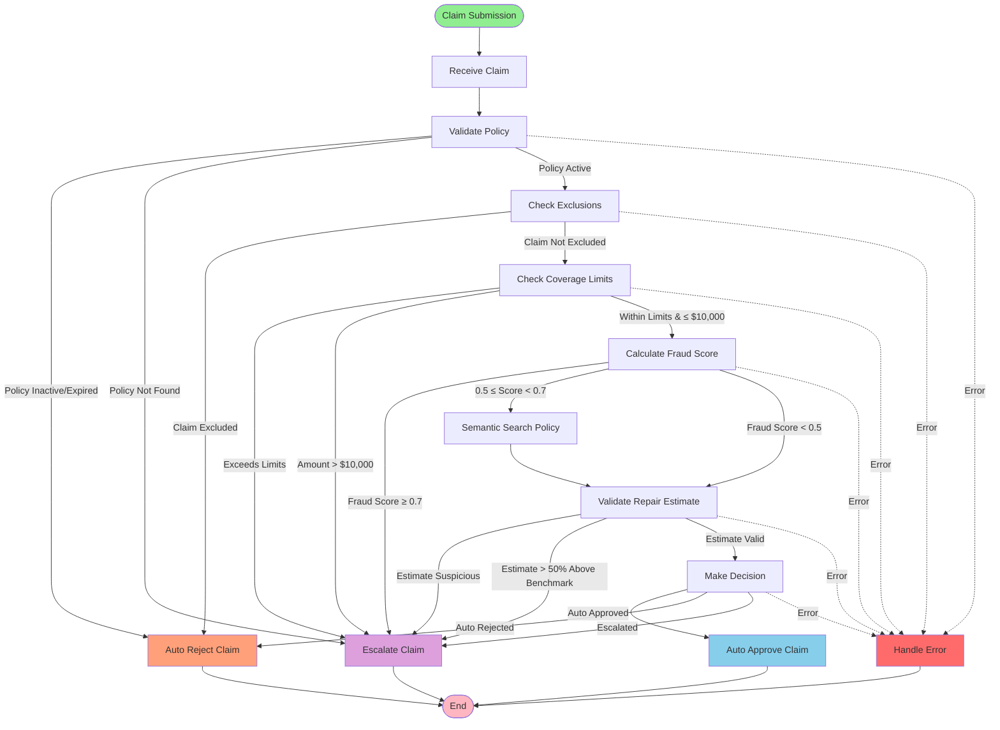

# LangGraph Architecture Logic
## ClaimGuardian: State Machine Design

**Version:** 1.0  
**Date:** 2026

---

## Overview

ClaimGuardian uses LangGraph to orchestrate a state machine that processes insurance claims through a series of decision nodes. The state machine maintains claim context, applies conditional logic for routing, and ensures all claims follow a consistent processing pipeline.

---

## State Schema

The state object passed between nodes contains:

```python
{
    "submission_id": str,           # Unique claim submission ID
    "user_id": str,                 # Policyholder ID
    "policy_id": str,               # Policy ID
    "claim_type": str,              # Type of claim (e.g., "Water_Damage")
    "claim_amount": float,          # Claim amount requested
    "incident_description": str,    # Natural language description
    "incident_date": date,          # Date of incident
    "repair_estimate": float,       # Repair estimate amount
    "repair_description": str,      # Repair work description
    
    # Processing state
    "current_node": str,            # Current node in state machine
    "processing_status": str,       # "Processing", "Completed", "Error"
    
    # Analysis results (populated during processing)
    "policy_data": dict,            # Policy information from query_policy()
    "fraud_score": float,           # Fraud risk score (0.0 to 1.0)
    "fraud_indicators": list,       # List of fraud indicators
    "coverage_check": dict,         # Coverage limit validation results
    "exclusion_check": dict,        # Policy exclusion check results
    "estimate_validation": dict,    # Repair estimate validation results
    "policy_clauses": list,         # Relevant policy clauses from semantic search
    
    # Decision state
    "decision": str,                # "Auto_Approved", "Auto_Rejected", "Escalated", None
    "decision_rationale": str,      # Human-readable explanation
    "error_message": str,           # Error message if processing fails
}
```

---

## Nodes (Processing Steps)

### Node 1: `receive_claim`
**Type:** Entry Node  
**Purpose:** Initialize claim processing state from submission data

**Actions:**
- Validate required fields (user_id, policy_id, claim_amount, etc.)
- Create submission record in `Claim_Submissions` table
- Set `processing_status` to "Processing"
- Set `current_node` to "receive_claim"

**Output:** State with initialized claim data

**Next Node:** Always → `validate_policy`

---

### Node 2: `validate_policy`
**Type:** Validation Node  
**Purpose:** Verify policy is active and retrieve policy information

**Actions:**
- Call `query_policy(policy_id)` to retrieve policy data
- Check if policy status is "Active"
- Check if current date is within policy effective date range
- Store policy data in state

**Output:** State with `policy_data` populated

**Conditional Logic:**
- **If policy is inactive or expired:** → `auto_reject_claim` (with reason: "Policy is not active")
- **If policy is active:** → `check_exclusions`

**Error Handling:**
- If `PolicyNotFoundError`: → `escalate_claim` (with error: "Policy not found")
- If `PolicyExpiredError`: → `auto_reject_claim` (with reason: "Policy expired")

---

### Node 3: `check_exclusions`
**Type:** Validation Node  
**Purpose:** Check if claim type is excluded under the policy

**Actions:**
- Call `check_policy_exclusions(policy_id, claim_type)`
- Store exclusion check results in state

**Output:** State with `exclusion_check` populated

**Conditional Logic:**
- **If `is_excluded == True`:** → `auto_reject_claim` (with reason: "Claim type is excluded under policy")
- **If `is_excluded == False`:** → `check_coverage_limits`

---

### Node 4: `check_coverage_limits`
**Type:** Validation Node  
**Purpose:** Verify claim amount is within policy coverage limits

**Actions:**
- Call `check_coverage_limits(policy_id, claim_amount, claim_type)`
- Calculate net payout (claim_amount - deductible)
- Store coverage check results in state

**Output:** State with `coverage_check` populated

**Conditional Logic:**
- **If `is_within_limits == False`:** → `escalate_claim` (with reason: "Claim exceeds coverage limits")
- **If `is_within_limits == True` AND `claim_amount > 10000`:** → `escalate_claim` (with reason: "High-value claim requires human review")
- **If `is_within_limits == True` AND `claim_amount <= 10000`:** → `calculate_fraud_score`

---

### Node 5: `calculate_fraud_score`
**Type:** Analysis Node  
**Purpose:** Assess fraud risk for the claim

**Actions:**
- Call `retrieve_claim_history(user_id, lookback_months=24)` to get historical claims
- Call `calculate_fraud_score(user_id, claim_data)` to compute fraud risk
- Store fraud score and indicators in state

**Output:** State with `fraud_score` and `fraud_indicators` populated

**Conditional Logic:**
- **If `fraud_score >= 0.7`:** → `escalate_claim` (with reason: "High fraud risk detected")
- **If `fraud_score < 0.7` AND `fraud_score >= 0.5`:** → `semantic_search_policy` (for additional review)
- **If `fraud_score < 0.5`:** → `validate_repair_estimate`

---

### Node 6: `semantic_search_policy`
**Type:** Analysis Node  
**Purpose:** Find relevant policy clauses for ambiguous claims or medium-risk fraud cases

**Actions:**
- Construct semantic query from `incident_description` and `claim_type`
- Call `semantic_search_policy(query, policy_version, top_k=5)`
- Store relevant policy clauses in state

**Output:** State with `policy_clauses` populated

**Next Node:** Always → `validate_repair_estimate`

---

### Node 7: `validate_repair_estimate`
**Type:** Validation Node  
**Purpose:** Validate repair cost estimate against industry benchmarks

**Actions:**
- Call `validate_repair_estimate(repair_description, repair_estimate, claim_type, region)`
- Store estimate validation results in state

**Output:** State with `estimate_validation` populated

**Conditional Logic:**
- **If `validation_status == "Suspicious"`:** → `escalate_claim` (with reason: "Repair estimate appears suspicious")
- **If `validation_status == "Above_Range"` AND `variance_percentage > 50%`:** → `escalate_claim` (with reason: "Repair estimate significantly above benchmark")
- **If `validation_status == "Within_Range"` OR `validation_status == "Below_Range"`:** → `make_decision`

---

### Node 8: `make_decision`
**Type:** Decision Node  
**Purpose:** Apply business rules to determine final claim decision

**Actions:**
- Evaluate all analysis results:
  - Policy is active: ✓
  - Not excluded: ✓
  - Within coverage limits: ✓
  - Fraud score < 0.7: ✓
  - Estimate validated: ✓
  - Claim amount ≤ $10,000: ✓
- Apply decision rules:
  - **Auto-Approve:** All conditions met AND fraud_score < 0.5 AND claim_amount ≤ $5,000
  - **Auto-Approve (with review flag):** All conditions met AND fraud_score < 0.5 AND $5,000 < claim_amount ≤ $10,000
  - **Escalate:** Any condition not met OR fraud_score ≥ 0.5 OR claim_amount > $10,000
- Generate decision rationale using `generate_decision_rationale()`
- Store decision and rationale in state

**Output:** State with `decision` and `decision_rationale` populated

**Conditional Logic:**
- **If `decision == "Auto_Approved"`:** → `auto_approve_claim`
- **If `decision == "Auto_Rejected"`:** → `auto_reject_claim`
- **If `decision == "Escalated"`:** → `escalate_claim`

---

### Node 9: `auto_approve_claim`
**Type:** Action Node  
**Purpose:** Finalize auto-approval and initiate payout

**Actions:**
- Update `Claim_Submissions` table: set `submission_status` to "Auto_Approved"
- Create record in `Claim_History` table with approved status
- Call Payment API to initiate payout
- Call Notification API to notify policyholder
- Call `log_claim_decision()` to create audit trail
- Set `processing_status` to "Completed"

**Output:** State with final decision logged

**Next Node:** Always → `END` (terminal node)

---

### Node 10: `auto_reject_claim`
**Type:** Action Node  
**Purpose:** Finalize auto-rejection and notify policyholder

**Actions:**
- Update `Claim_Submissions` table: set `submission_status` to "Auto_Rejected"
- Create record in `Claim_History` table with rejected status
- Call Notification API to notify policyholder with rejection reason
- Call `log_claim_decision()` to create audit trail
- Set `processing_status` to "Completed"

**Output:** State with final decision logged

**Next Node:** Always → `END` (terminal node)

---

### Node 11: `escalate_claim`
**Type:** Action Node  
**Purpose:** Route claim to human adjuster queue with enriched context

**Actions:**
- Update `Claim_Submissions` table: set `submission_status` to "Escalated"
- Create record in `Claim_History` table with escalated status
- Prepare enriched context package:
  - All analysis results (fraud score, coverage check, estimate validation)
  - Relevant policy clauses
  - Decision rationale
  - Processing path (nodes traversed)
- Call Escalation API to route to adjuster queue
- Call Notification API to notify policyholder of escalation
- Call `log_claim_decision()` to create audit trail
- Set `processing_status` to "Completed"

**Output:** State with escalation logged

**Next Node:** Always → `END` (terminal node)

---

### Node 12: `handle_error`
**Type:** Error Handling Node  
**Purpose:** Handle processing errors and route appropriately

**Actions:**
- Log error details in state
- Update `Claim_Submissions` table: set `submission_status` to "Error"
- Determine error severity:
  - **Critical errors** (e.g., database failure): Escalate to technical team
  - **Data errors** (e.g., missing required fields): Escalate to human adjuster
- Call Notification API to notify policyholder of processing delay
- Set `processing_status` to "Error"

**Output:** State with error information

**Next Node:** Always → `END` (terminal node)

---

## Edges (Transitions)

### Entry Edge
- **From:** `START` (external trigger)
- **To:** `receive_claim`
- **Condition:** Always (claim submission received)

---

### Sequential Edges (No Conditions)
- `receive_claim` → `validate_policy` (always)
- `semantic_search_policy` → `validate_repair_estimate` (always)
- `auto_approve_claim` → `END` (always)
- `auto_reject_claim` → `END` (always)
- `escalate_claim` → `END` (always)
- `handle_error` → `END` (always)

---

### Conditional Edges

#### From `validate_policy`:
- **If policy inactive/expired:** → `auto_reject_claim`
- **If policy not found:** → `escalate_claim`
- **If policy active:** → `check_exclusions`

#### From `check_exclusions`:
- **If claim excluded:** → `auto_reject_claim`
- **If claim not excluded:** → `check_coverage_limits`

#### From `check_coverage_limits`:
- **If exceeds limits:** → `escalate_claim`
- **If claim_amount > $10,000:** → `escalate_claim`
- **If within limits AND claim_amount ≤ $10,000:** → `calculate_fraud_score`

#### From `calculate_fraud_score`:
- **If fraud_score ≥ 0.7:** → `escalate_claim`
- **If 0.5 ≤ fraud_score < 0.7:** → `semantic_search_policy`
- **If fraud_score < 0.5:** → `validate_repair_estimate`

#### From `validate_repair_estimate`:
- **If estimate suspicious:** → `escalate_claim`
- **If estimate > 50% above benchmark:** → `escalate_claim`
- **If estimate valid:** → `make_decision`

#### From `make_decision`:
- **If decision == "Auto_Approved":** → `auto_approve_claim`
- **If decision == "Auto_Rejected":** → `auto_reject_claim`
- **If decision == "Escalated":** → `escalate_claim`

---

## Conditional Logic Summary

### Auto-Approval Conditions (ALL must be true):
1. Policy is active and within effective date range
2. Claim type is NOT excluded under policy
3. Claim amount is within coverage limits
4. Claim amount ≤ $5,000 (or ≤ $10,000 with review flag)
5. Fraud score < 0.5
6. Repair estimate is validated (within range or below range)
7. No critical errors during processing

### Auto-Rejection Conditions (ANY can trigger):
1. Policy is inactive or expired
2. Claim type is excluded under policy
3. Clear policy violation detected

### Escalation Conditions (ANY can trigger):
1. Policy not found (data error)
2. Claim amount exceeds coverage limits
3. Claim amount > $10,000
4. Fraud score ≥ 0.7 (high risk)
5. Fraud score ≥ 0.5 AND < 0.7 (medium risk - requires review)
6. Repair estimate is suspicious or significantly above benchmark
7. Any processing error that cannot be auto-handled

---

## State Machine Flow Diagram (Mermaid.js Compatible)



---

## Processing Paths

### Path 1: Fast Auto-Approval (Ideal Path)
**Nodes:** `receive_claim` → `validate_policy` → `check_exclusions` → `check_coverage_limits` → `calculate_fraud_score` → `validate_repair_estimate` → `make_decision` → `auto_approve_claim` → `END`

**Conditions:** Low-value claim (≤$5,000), low fraud risk (<0.5), valid estimate, no exclusions

**Expected Time:** < 5 minutes

---

### Path 2: Medium-Risk Review
**Nodes:** `receive_claim` → `validate_policy` → `check_exclusions` → `check_coverage_limits` → `calculate_fraud_score` → `semantic_search_policy` → `validate_repair_estimate` → `make_decision` → `auto_approve_claim` → `END`

**Conditions:** Medium fraud risk (0.5-0.7), requires policy clause review

**Expected Time:** < 10 minutes

---

### Path 3: Auto-Rejection
**Nodes:** `receive_claim` → `validate_policy` → `auto_reject_claim` → `END`  
OR  
`receive_claim` → `validate_policy` → `check_exclusions` → `auto_reject_claim` → `END`

**Conditions:** Policy expired/inactive OR claim type excluded

**Expected Time:** < 2 minutes

---

### Path 4: Escalation (High-Risk or Complex)
**Nodes:** `receive_claim` → `validate_policy` → `check_exclusions` → `check_coverage_limits` → `escalate_claim` → `END`  
OR  
`receive_claim` → `validate_policy` → `check_exclusions` → `check_coverage_limits` → `calculate_fraud_score` → `escalate_claim` → `END`  
OR  
`receive_claim` → `validate_policy` → `check_exclusions` → `check_coverage_limits` → `calculate_fraud_score` → `validate_repair_estimate` → `escalate_claim` → `END`

**Conditions:** High-value claim (>$10,000), high fraud risk (≥0.7), suspicious estimate, or exceeds coverage

**Expected Time:** < 15 minutes (to escalation point)

---

## State Persistence

- State is persisted after each node execution to `Claim_Submissions` table
- `current_node` field tracks progress through state machine
- State can be resumed from any node if processing is interrupted
- Full audit trail maintained in `Claim_History` and `Fraud_Indicators` tables

---

## Error Recovery

- **Transient Errors:** Automatic retry (up to 3 attempts) with exponential backoff
- **Persistent Errors:** Route to `handle_error` node, which escalates to human or technical team
- **State Recovery:** If processing fails, state can be reloaded from database and resumed from last successful node

---

**Document Owner:** Solutions Architecture Team  
**Last Updated:** 2024
